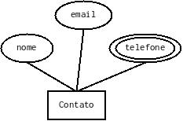

# Desafio Backend Novaweb

Este desafio é parte do processo seletivo para a vaga "Desenvolvedor backend" da empresa Novaweb. As habilidades esperadas de um desenvolvedor backend são:

 *  Ser capaz de desenvolver APIs REST utilizando linguagens modernas, em especial C# e/ou Python
 *  Ser capaz de realizar o deploy de APIs utilizando docker e kubernetes
 *  Ser capaz de monitorar e diagnosticar erros em APIs rodando em ambiente k8s na cloud

Neste desafio, buscamos compreender o seu nível nestas habilidades.

## Instruções

Clone este repositório e implemente sua solução. Em seguida, dentro do prazo estipulado (10 dias), **envie o link do repositório para mateust@novaweb.mobi com cópia para celso@novaweb.mobi junto com seu currículo**.

Você pode cumprir este desafio de três formas:

1. Implementar a solução para o problema utilizando a [NovaAPI](https://github.com/novaweb-mobi/NovaAPI) em python, incluindo ao menos uma carga de trabalho do github actions que publica uma imagem docker no github packages do seu repositório, ou;
2. Implementar a solução para o problema utilizando .NET, incluindo ao menos uma carga de trabalho do github actions que publica uma imagem docker no github packages do seu repositório, ou;
3. Implementar a solução na linguagem de sua preferência, incluindo ao menos uma carga de trabalho do github actions que publica uma imagem docker no github packages do seu repositório e um arquivo de deploy para um cluster kubernetes.

## Descrição do problema

Neste desafio, você deverá implementar uma API de contatos que inclua o nome da contato, um email e múltiplos telefones. Sua solução deve implementar o modelo entidade relacionamento abaixo, pelo menos.

### Requisitos

Para este desafio você deverá usar um banco de dados PostgreSQL. Sugerimos que utilize para testes o serviço [ElephantSQL](elephantsql.com), que disponibiliza um banco de dados gratuito na cloud. A configuração do seu banco de dados deverá ser feito via variáveis de ambiente do contêiner.

Você deverá disponibilizar uma documentação da API pública. Sugerimos que utilize uma collection do Postman ou do Insomnia.

## Avaliação

Serão avaliados os seguintes critérios:

 * Se o seu código está bem escrito de acordo com o Clean Code
 * A utilização de testes
 * A documentação da API pública
 * A imagem docker
 * O seu uso do git/github
 * O arquivo de deploy k8s (caso implementado)

## Observações

Ao enviar a solução, você afirma que o trabalho entregue é fruto do seu próprio trabalho, exceto onde explicitamente especificado. Você também afirma que nenhuma licença está sendo violada pela solução implementada e entregue.
